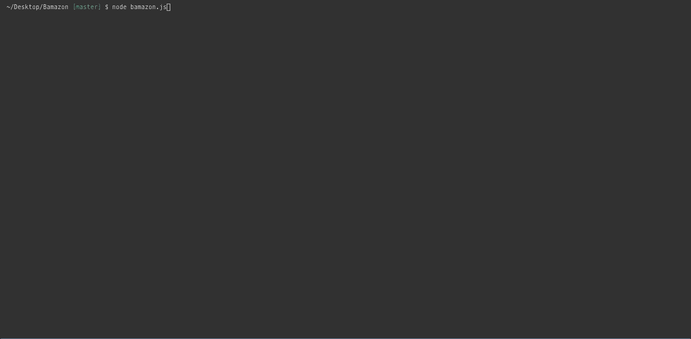
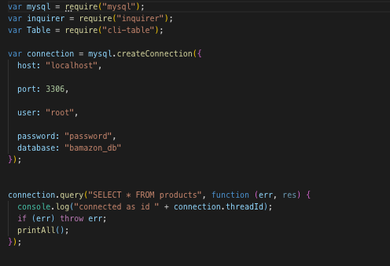
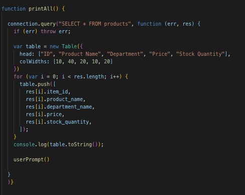
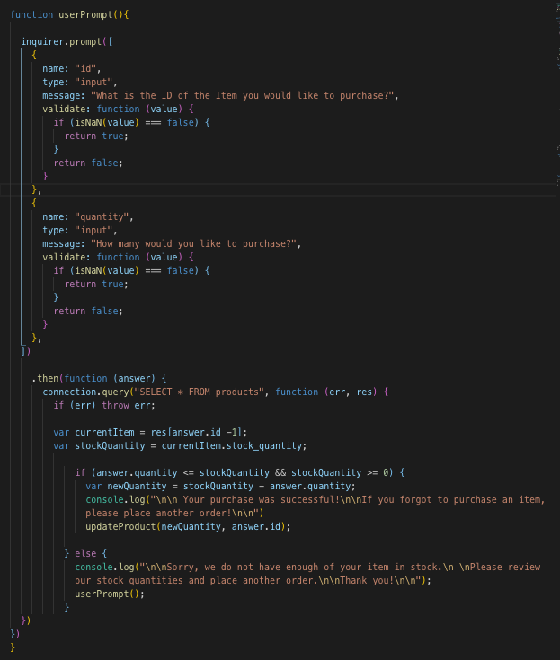
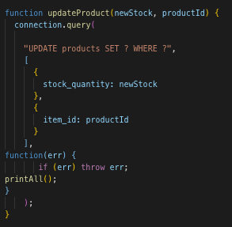

# Bamazon

This is my submission for assignment ten: Bamazon. We were tasked with creating an CLI App that replicates an Amazon-like storefront using our recent understanding of MySQL. The app takes in orders from customers and depletes stock from the store's inventory once a purchase is made. If the customer requests a quantity that is higher than what the store has in stock, they are notified that the transaction cannot happen and are prompted again using inquirer to make a purchase. In order to accomplish this, I had to utilize my understanding of JavaScript, SQL, MySQL Workbench, and Node.js as well as various node packages including mysql, cli-table and inquirer.

# Connection to MySQL Workbench 

# Displaying Table to Customer 

# Prompting the Customer Using Inquirer

# Updating Stock Quantity

# Tech I Used:

[Node.js](https://www.w3schools.com/nodejs/)

[JavaScript](https://www.w3schools.com/js/)

[SQL](https://www.w3schools.com/sql/)

[MySQL Workbench](https://www.mysql.com/products/workbench/)

[inquirer npm](https://www.npmjs.com/package/inquirer)

[mysql npm](https://www.npmjs.com/package/mysql)

[cli-table](https://www.npmjs.com/package/cli-table)

Author: [Matthew Hagarty](https://github.com/matthewryanhagarty)